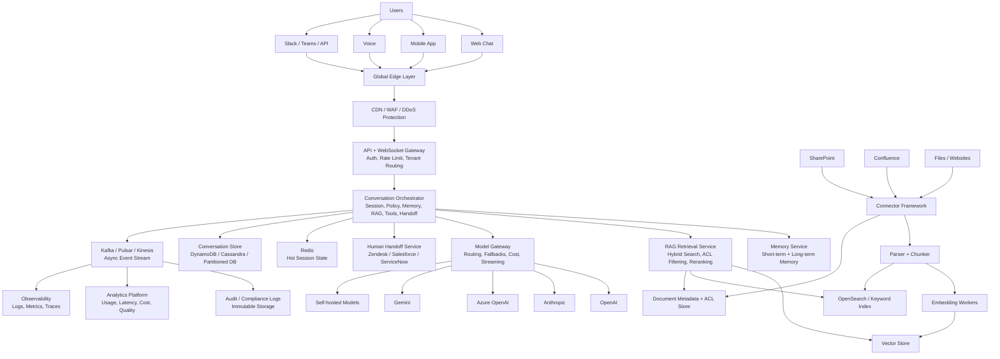
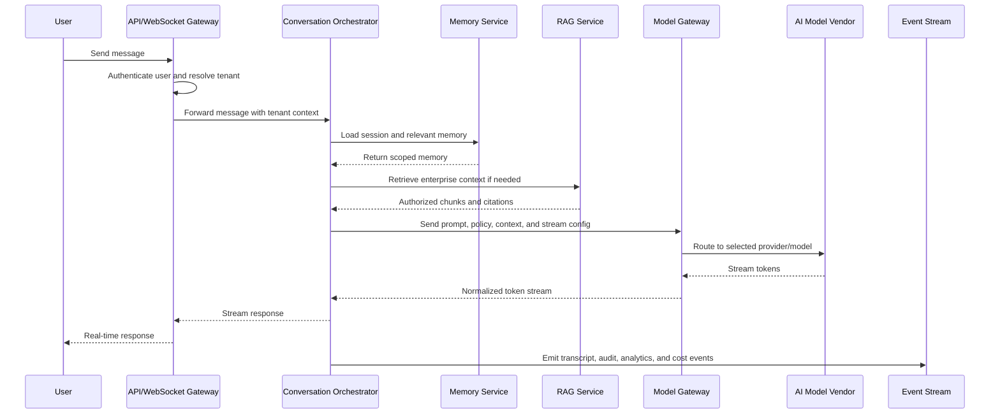
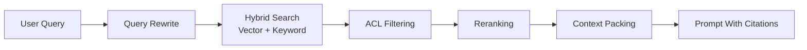
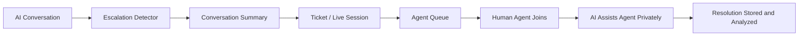
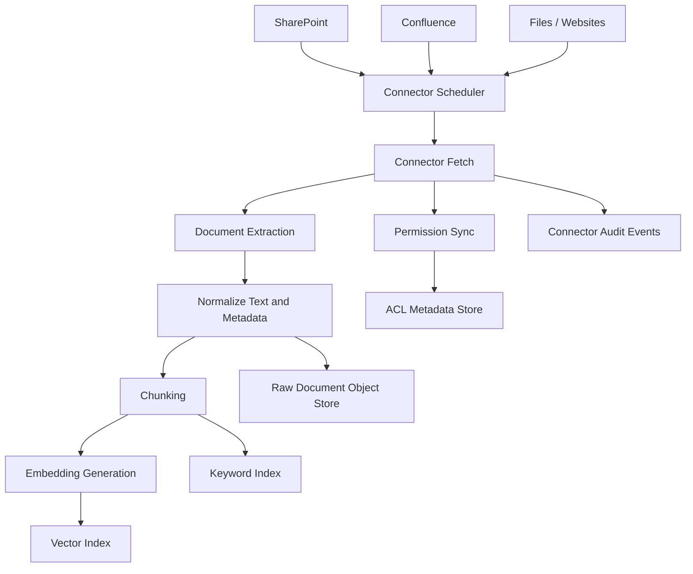
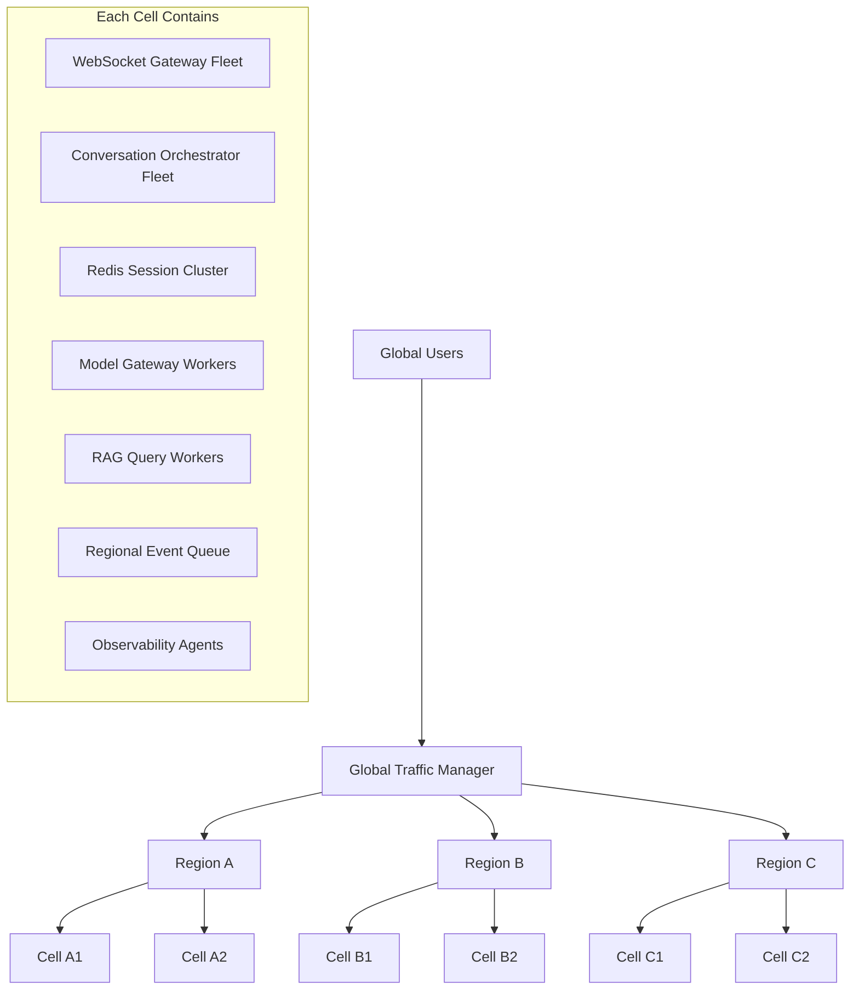

# Enterprise AI Conversation Platform - Principal Engineer Design

## 1. Executive Summary

This platform should not be designed as a chatbot. It should be designed as a
multi-tenant, real-time AI orchestration platform that supports:

- Voice and chat conversations
- Real-time streaming responses
- Multilingual interactions
- Retrieval augmented generation over enterprise knowledge sources
- Conversation memory
- Analytics dashboards
- Human escalation and handoff
- Enterprise compliance and auditability
- SharePoint and Confluence integrations
- 1 million concurrent conversations
- Sub-2 second perceived latency
- 99.99% availability
- Multi-region deployment
- Multiple AI model vendors
- Enterprise tenant isolation
- Cost optimization, observability, and debugging

The core architectural principle is:

> Keep the real-time serving path thin. Move ingestion, indexing, analytics,
> audit enrichment, summarization, and reporting to asynchronous pipelines.

---

## 2. Design Principles

| Principle | Architectural Consequence |
|---|---|
| Real-time path stays thin | Only auth, session lookup, policy, retrieval, model call, and streaming are on the synchronous path |
| Tenant isolation is foundational | Tenant ID, policy, keys, indexes, logs, and model routing are scoped from the first request |
| RAG is permission-aware | Retrieved content is filtered by user and tenant permissions before it reaches the model |
| Model access goes through a gateway | Product services never call model vendors directly |
| Degrade gracefully | Analytics, memory, non-critical RAG, and dashboards can fail without taking conversations down |
| Cost is a first-class requirement | Every model call tracks tokens, latency, provider, tenant, feature, and budget |
| Auditability is non-negotiable | Every admin action, data access, model call, tool call, and handoff has an immutable record |

---

## 3. High-Level Architecture



---

## 4. Runtime Data Flow

### 4.1 Chat Conversation Flow



### 4.2 Voice Conversation Flow

```mermaid
flowchart LR
    Audio[User Audio Stream] --> VoiceGateway[Voice Gateway]
    VoiceGateway --> STT[Streaming Speech-to-Text]
    STT --> PartialTranscript[Partial Transcript]
    PartialTranscript --> Orchestrator[Conversation Orchestrator]
    Orchestrator --> RAG[RAG / Memory / Tools]
    RAG --> ModelGateway[Model Gateway]
    ModelGateway --> LLM[Low-latency LLM]
    LLM --> TextStream[Streaming Text Response]
    TextStream --> TTS[Streaming Text-to-Speech]
    TTS --> AudioOut[Audio Back to User]
```



For voice, optimize for time to first audible response, not only full response
completion time. Use partial transcription, early intent detection, streaming
LLM output, streaming TTS, and barge-in support.

---

## 5. Core Services

### 5.1 API and WebSocket Gateway

Responsibilities:

- Terminate WebSocket, SSE, and HTTP connections
- Authenticate users
- Resolve tenant and region
- Enforce rate limits and quotas
- Route active conversations to the correct cell
- Maintain connection affinity for streaming sessions

Supported protocols:

- WebSocket for bidirectional chat and voice
- SSE for simple one-way response streaming
- HTTP/gRPC for service-to-service requests

### 5.2 Conversation Orchestrator

The orchestrator owns the synchronous conversation path.

Responsibilities:

- Load active session state
- Apply tenant policy
- Decide whether RAG is needed
- Inject relevant memory
- Execute read-only tools
- Trigger human handoff
- Assemble the model prompt
- Stream model output back to the user
- Emit async events for storage, analytics, audit, and cost tracking

The orchestrator should be stateless. Active state belongs in Redis or another
distributed low-latency cache.

### 5.3 Model Gateway

All model access should go through the Model Gateway. Product and orchestration
services should not directly call OpenAI, Anthropic, Gemini, Azure OpenAI, or
self-hosted models.

Responsibilities:

- Normalize requests and streaming responses across vendors
- Route by tenant policy, latency, cost, model capability, and region
- Enforce tenant model allowlists
- Track token usage and cost
- Apply retries, timeouts, circuit breakers, and fallbacks
- Support provider-specific features behind a stable internal API

Example routing policy:

| Request Type | Model Strategy |
|---|---|
| Simple FAQ | Small, cheap model |
| Complex reasoning | Stronger frontier model |
| Sensitive enterprise tenant | Azure/private/self-hosted model |
| Voice response | Fastest low-latency model |
| Vendor outage | Fallback provider |
| Budget pressure | Lower-cost model or shorter context |

### 5.4 RAG Retrieval Service

Enterprise RAG must be permission-aware.

Query flow:



The model must never receive content the user is not authorized to access.

Each chunk should include:

- Tenant ID
- Document ID
- Source system
- Source URL
- Version
- ACL metadata
- Language
- Retention policy
- Embedding model version

### 5.5 Human Handoff Service

Escalation should be a first-class workflow, not an afterthought.

Triggers:

- User asks for a human
- Low model confidence
- Negative sentiment
- Repeated failed answers
- Compliance-sensitive topic
- Tenant-defined escalation rule

Flow:



---

## 6. Knowledge Ingestion and RAG Indexing



Connector requirements:

- OAuth-based tenant credentials
- Incremental sync
- Webhook-based updates where available
- Periodic full reconciliation
- Permission mirroring
- Document deletion handling
- Version tracking
- Source citations
- Tenant-specific connector config

---

## 7. Storage Architecture

| Data | Recommended Storage | Why |
|---|---|---|
| Tenant config | PostgreSQL / Aurora / Cloud SQL | Strong consistency, relational config |
| Users, roles, permissions | PostgreSQL | RBAC, ABAC, SSO mappings |
| Active sessions | Redis / Dragonfly / KeyDB | Low-latency runtime state |
| Conversation messages | DynamoDB / Cassandra / Cosmos DB / partitioned Postgres | High write throughput and partitioning |
| Event stream | Kafka / Pulsar / Kinesis | Durable async fanout |
| Raw documents | S3 / GCS / Azure Blob | Durable object storage |
| Embeddings | Pinecone / Weaviate / Milvus / OpenSearch / pgvector | Vector retrieval |
| Keyword search | OpenSearch / Elasticsearch | Exact search, filters, hybrid retrieval |
| Analytics | ClickHouse / BigQuery / Snowflake | Fast aggregation over high-volume events |
| Audit logs | Immutable object storage + searchable index | Compliance and legal hold |
| Secrets and keys | Vault / KMS / Secrets Manager | Secure secret and key management |

Avoid routing every hot conversation write through a single relational database.
At 1 million concurrent conversations, use partitioned/event-based storage and
async persistence.

---

## 8. Multi-Region and Cell-Based Scale

Use a cell-based architecture for scale and blast-radius control.



Cell benefits:

- Limits blast radius
- Supports tenant pinning
- Enables data residency
- Simplifies capacity planning
- Allows dedicated enterprise cells
- Makes regional failover boundaries explicit

Tenant deployment tiers:

| Tier | Deployment Model |
|---|---|
| Standard tenants | Shared regional cells |
| Large enterprise tenants | Dedicated cell |
| Regulated tenants | Dedicated region or private deployment |

---

## 9. Availability and Failure Handling

Target availability: 99.99%.

Required design choices:

- Multi-AZ deployment per region
- Active-active regions for critical tenants
- Stateless application services
- Circuit breakers around model vendors
- Model fallback
- Queue-based async recovery
- Backpressure and rate limiting
- Graceful degradation for non-critical dependencies

Failure-mode behavior:

| Failure | Expected Behavior |
|---|---|
| Analytics platform down | Continue serving; buffer analytics events |
| Vector DB slow | Use cached retrieval, keyword-only search, or answer without RAG if allowed |
| Model vendor down | Route to fallback provider |
| Memory service slow | Skip long-term memory and continue with current session |
| Audit search down | Continue writing immutable logs; search can recover later |
| Human handoff integration down | Create retryable internal handoff event |
| One regional cell unhealthy | Drain traffic and shift tenants to healthy cells |

---

## 10. Latency Design

Target: sub-2 second perceived latency.

Primary user-facing metrics:

- Time to first token
- Time to first useful response
- Full completion time
- Time to first audible response for voice

Approximate chat latency budget:

| Stage | Target |
|---|---:|
| Gateway/auth | 20-100 ms |
| Session/context lookup | 20-100 ms |
| RAG retrieval | 100-500 ms |
| Prompt assembly | 10-50 ms |
| Model first token | 300-1200 ms |
| Streaming overhead | 20-100 ms |

Latency strategies:

- Stream responses immediately
- Cache tenant config
- Cache hot session state
- Use small models for routing and classification
- Avoid RAG unless needed
- Cache frequent retrieval results
- Keep retrieval indexes region-local
- Avoid reranking on simple queries
- Use prompt compression and conversation summarization
- Pre-warm model provider connections

---

## 11. Tenant Isolation

Tenant isolation should exist at every layer.

| Layer | Isolation Strategy |
|---|---|
| API | Tenant ID required on every request |
| Auth | SSO/SAML/OIDC, SCIM provisioning |
| Application policy | Tenant-scoped policy and feature flags |
| Database | Tenant partitioning, schemas, or dedicated clusters |
| Vector store | Tenant namespaces or dedicated indexes |
| Object storage | Tenant prefixes or buckets |
| Encryption | Per-tenant keys and optional customer-managed keys |
| Model access | Tenant-specific model/vendor allowlists |
| Analytics | Tenant-scoped dashboards and exports |
| Audit | Tenant-scoped immutable audit streams |

For large enterprise customers, use dedicated cells or dedicated infrastructure.

---

## 12. Compliance and Auditability

Enterprise capabilities:

- SSO/SAML/OIDC
- SCIM provisioning
- RBAC and ABAC
- Encryption in transit and at rest
- Customer-managed keys
- Immutable audit logs
- Data retention policies
- Legal hold
- GDPR/CCPA deletion workflows
- PII detection and redaction
- Regional data residency
- Prompt and response retention controls
- No-training guarantees
- Admin activity logging

Every audit record should answer:

```text
who did what,
when,
from where,
for which tenant,
against which data,
using which model,
under which policy.
```

---

## 13. Analytics Dashboard

The analytics platform should consume events asynchronously from the event
stream. It should not sit on the real-time serving path.

### Product Metrics

- Active conversations
- Messages per tenant
- Containment rate
- Escalation rate
- CSAT
- Resolution rate

### AI Metrics

- Model latency
- Time to first token
- Token usage
- Cost per conversation
- RAG hit rate
- Citation usage
- Fallback rate
- Hallucination reports

### Operational Metrics

- WebSocket connections
- Error rate
- Queue lag
- Regional health
- P95/P99 latency
- Vendor outage impact

### Compliance Metrics

- Audit event volume
- Data access events
- PII events
- Retention status
- Policy violations
- Admin actions

---

## 14. AI Cost Optimization

Cost controls belong in the Model Gateway and orchestration policy layer.

Techniques:

- Route simple requests to cheaper models
- Use stronger models only when needed
- Apply prompt compression
- Summarize long conversations
- Cache common retrievals and safe responses
- Cache embeddings
- Batch embedding generation
- Enforce per-tenant budgets
- Track cost by tenant, feature, model, provider, and workflow
- Use self-hosted models for high-volume, low-risk workloads

Example model routing:

| Workload | Recommended Model Class |
|---|---|
| Intent classification | Small fast model |
| Retrieval query rewrite | Small or mid-tier model |
| RAG answer generation | Mid-tier or strong model |
| Complex reasoning | Frontier model |
| Summarization | Cheap summarization model |
| Safety classification | Specialized classifier |

---

## 15. Bottlenecks and Mitigations

| Bottleneck | Risk | Mitigation |
|---|---|---|
| LLM latency | Dominates response time | Streaming, model routing, provider fallback |
| Model vendor outage | External dependency risk | Multi-vendor Model Gateway |
| Vector search | Expensive at high scale | Shard by tenant, cache, hybrid retrieval |
| ACL filtering | Complex enterprise RAG behavior | Precomputed permission indexes |
| WebSocket scale | 1 million connections is operationally hard | Regional cell-based gateway fleets |
| Voice latency | STT + LLM + TTS chain | Streaming STT/TTS and partial transcript processing |
| Cost explosion | Token usage can grow quickly | Budgets, routing, compression, caching |
| Audit volume | Huge write load | Async append-only storage |
| Tenant isolation | Strong isolation increases complexity | Tiered isolation model |

---

## 16. Major Tradeoffs

### RAG quality vs latency

RAG improves correctness and enterprise usefulness, but adds retrieval and
reranking latency.

Recommendation:

- Use RAG selectively
- Cache frequent retrievals
- Use hybrid search
- Skip reranking for simple cases

### Tenant isolation vs cost

Dedicated infrastructure improves security and compliance but costs more.

Recommendation:

- Shared cells for standard tenants
- Dedicated cells for large enterprise tenants
- Private deployments for regulated customers

### Multi-vendor support vs complexity

Multi-vendor model support improves resilience and negotiating power, but
increases integration complexity.

Recommendation:

- Build the Model Gateway early
- Normalize requests and streaming responses
- Hide vendor-specific behavior behind adapters

### Conversation memory vs privacy

Memory improves personalization but increases privacy and compliance risk.

Recommendation:

- Make memory tenant-configurable
- Store summaries rather than raw history where possible
- Make memory auditable and deletable

---

## 17. Principal Engineer Recommendation

Build this as a:

> Multi-region, cell-based, event-driven AI conversation platform with a thin
> real-time serving path, a Model Gateway, permission-aware RAG, strong tenant
> isolation, async analytics/audit pipelines, and enterprise compliance controls.

The highest-leverage decisions are:

1. Build a Model Gateway from the beginning.
2. Use cell-based regional scaling for 1 million concurrent conversations.
3. Keep analytics, audit enrichment, ingestion, and indexing asynchronous.
4. Make RAG permission-aware from day one.
5. Treat tenant isolation and compliance as core architecture, not add-ons.
6. Optimize for streaming and time to first token.
7. Put cost controls and observability around every model call.

---

## 18. Presentation Talk Track

Use this short script when presenting the design:

1. "I am not treating this as a chatbot. I am treating it as a real-time,
   multi-tenant AI orchestration platform."
2. "The central design choice is to keep the synchronous conversation path
   thin and push everything else into async pipelines."
3. "The two most important platform seams are the Conversation Orchestrator
   and the Model Gateway."
4. "Enterprise RAG is permission-aware by design. The model never sees data
   the user cannot access."
5. "At 1 million concurrent conversations, I would use multi-region cells for
   blast-radius control, tenant pinning, and predictable scaling."
6. "For 99.99% availability, the system degrades gracefully: model fallback,
   cached or reduced RAG, async analytics, and regional failover."
7. "Cost and observability are not dashboards added later. They are captured
   around every model call, retrieval request, and conversation event."
