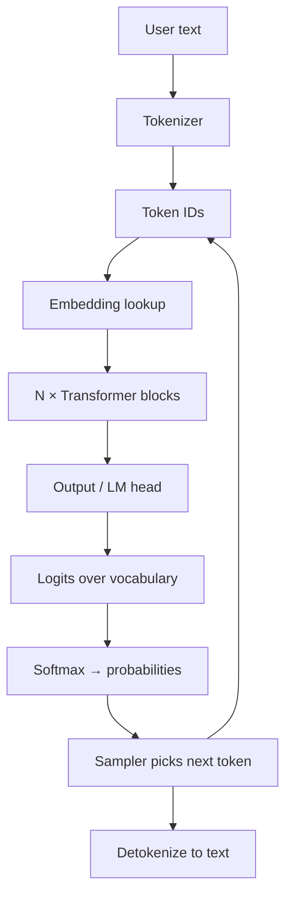
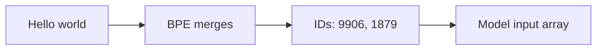
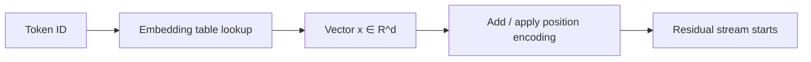
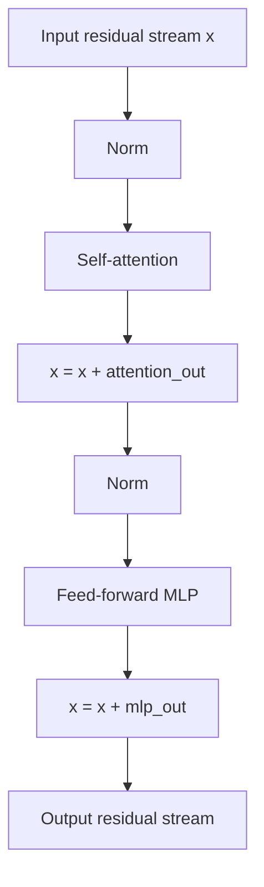
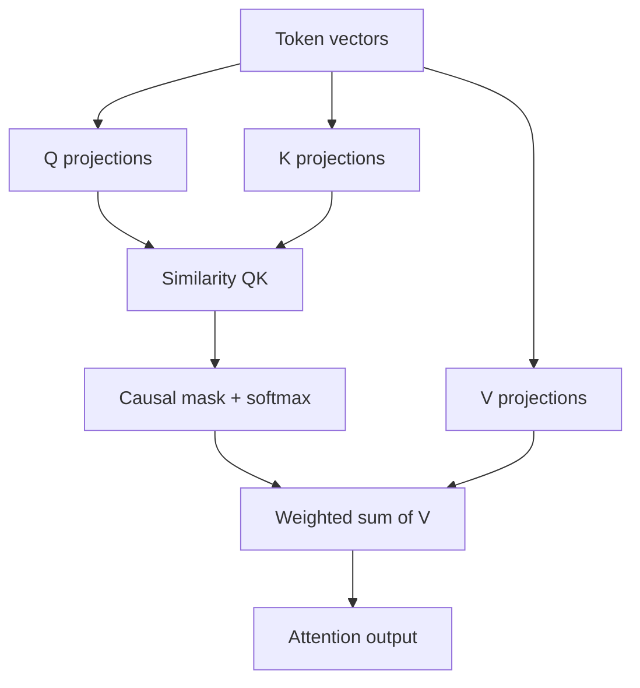
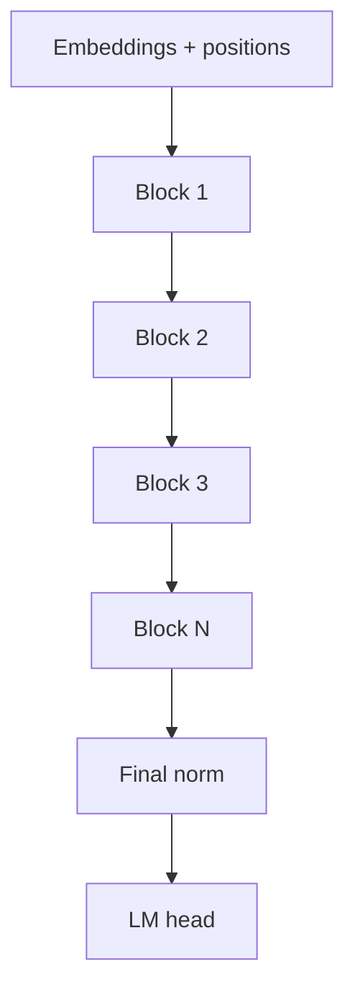
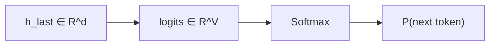
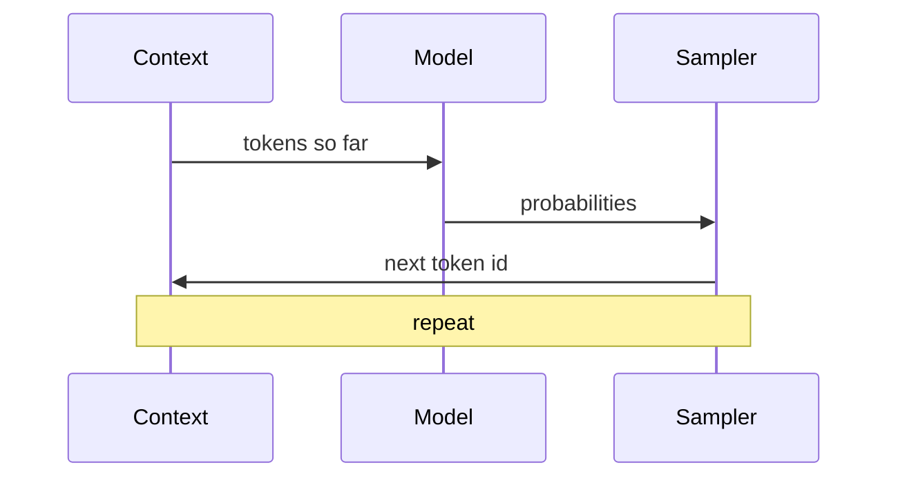
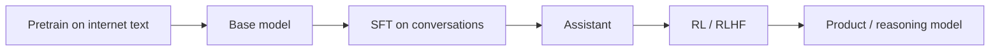
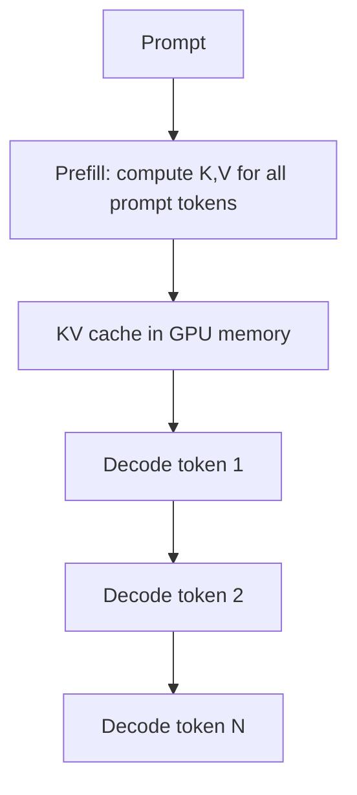

# How LLMs Work Under the Hood

A mechanics-first guide: what happens inside a model when you type a prompt and get an answer.

Companion to [Karpathy Deep Dive notes](./KARPATHY-DEEP-DIVE-LLMS-NOTES.md) (training pipeline / product stack). This doc focuses on the **runtime + math shape** of a Transformer LLM.

---

## Table of contents

1. [One-sentence truth](#1-one-sentence-truth)
2. [End-to-end path of a prompt](#2-end-to-end-path-of-a-prompt)
3. [Tokens: text becomes integers](#3-tokens-text-becomes-integers)
4. [Embeddings: integers become vectors](#4-embeddings-integers-become-vectors)
5. [The Transformer block](#5-the-transformer-block)
6. [Self-attention (the core trick)](#6-self-attention-the-core-trick)
7. [MLP / feed-forward layer](#7-mlp--feed-forward-layer)
8. [Stacking layers & residual stream](#8-stacking-layers--residual-stream)
9. [Output head: vectors → next-token odds](#9-output-head-vectors--next-token-odds)
10. [Sampling: probabilities → text](#10-sampling-probabilities--text)
11. [Training: how the weights get smart](#11-training-how-the-weights-get-smart)
12. [Inference optimizations (KV cache)](#12-inference-optimizations-kv-cache)
13. [What “understanding” actually is](#13-what-understanding-actually-is)
14. [Mental model cheat sheet](#14-mental-model-cheat-sheet)

---

## 1. One-sentence truth

An LLM is a huge function that maps a sequence of tokens → a probability distribution over the **next** token, then repeats that until it stops.

It does **not** look up a stored answer. It **generates** one token at a time from learned statistics shaped into billions of parameters.

```text
prompt tokens → model → P(next token) → pick one → append → repeat
```

---

## 2. End-to-end path of a prompt

### Diagram: request lifecycle



### Concrete tiny example

```text
User: "The cat sat on the"

Tokens (illustrative): [The] [cat] [sat] [on] [the]
Model predicts: mat≈0.41, floor≈0.18, sofa≈0.07, ...
Sample → "mat"
Now context: "The cat sat on the mat"
Predict again → ...
```

Everything “under the hood” is this loop plus the internals of the Transformer that produce those probabilities.

---

## 3. Tokens: text becomes integers

### Why tokens?

Neural nets need numbers. Tokenizers compress text into a fixed vocabulary of ~30k–100k+ symbols.

Common method: **BPE (Byte Pair Encoding)** — merge frequent character/byte pairs into longer tokens.

```text
"ChatGPT"  →  maybe ["Chat", "G", "PT"]  or similar
"strawberry" → often ["straw", "berry"]   (not letter-by-letter)
```

### Important consequences

- The model sees **token IDs**, not letters
- Spelling / letter-counting can be hard
- Context length is measured in **tokens**, not words
- Cost and latency scale with token count

### Diagram



---

## 4. Embeddings: integers become vectors

Each token ID indexes a row in an **embedding matrix** `E` of shape `[vocab_size × d_model]`.

```text
token_id 15496  →  vector of length d_model (e.g. 4096 floats)
```

That vector is the model’s starting representation of the token. Nearby meanings often end up nearby in vector space after training, but this is learned — not hardcoded.

Positional information (usually **RoPE** or similar) is mixed in so the model knows *order*, not just bag-of-tokens.



---

## 5. The Transformer block

A modern decoder-only LLM (GPT-style) is mostly a stack of identical blocks:

```text
x → Attention → + residual → MLP → + residual → next block
```

(with layer norms / RMSNorm around the pieces)

### Diagram: one block



**Why residuals?** They let information flow through many layers without vanishing, and let each layer add a “delta” of computation.

---

## 6. Self-attention (the core trick)

### Intuition

For each token position, attention asks:

> “Given what I am, which earlier tokens should I read, and what should I copy/combine from them?”

That is how “it” can refer to “the cat,” or how a closing brace can attend to an opening brace.

### Mechanics (simplified)

For each position, project the residual stream into:

- **Q** (query): what am I looking for?
- **K** (key): what do I contain?
- **V** (value): what do I pass along if selected?

Then:

```text
scores = Q · Kᵀ / √d
weights = softmax(scores)      # for causal LM: mask future tokens
output  = weights · V
```

### Causal mask (why chat is left-to-right)

Decoder LLMs are **autoregressive**: position `t` may only attend to positions `≤ t`. It cannot see future tokens that have not been generated yet.

```text
Position:  1   2   3   4
Token:    The cat sat on

"on" can attend to The/cat/sat/on
"sat" cannot attend to "on"  (future)
```

### Multi-head attention

Several attention heads run in parallel. Different heads specialize (syntax, local copy, long-range reference, etc.). Outputs are concatenated and projected back.

### Diagram



```text
Attention ≈ soft, content-based lookup over the context window
```

---

## 7. MLP / feed-forward layer

After attention mixes information **across tokens**, the MLP processes each position **independently**.

Typical shape:

```text
x → Linear(d → 4d) → activation (SiLU/GELU) → Linear(4d → d)
```

### Role

- Attention: move / combine information between positions
- MLP: do local nonlinear computation / “memory lookup” style transforms on each position

A common intuition: MLPs store a lot of factual associations; attention routes the right context into place for those computations.

---

## 8. Stacking layers & residual stream

GPT-style models stack dozens to over a hundred blocks.

Think of the **residual stream** as a shared workspace:

- Early layers: local syntax / shallow patterns
- Middle layers: features, references, some facts
- Late layers: decision-ish features for next-token prediction

This is a rough empirical picture, not a hard law — circuits vary.

### Diagram: depth



Compute intuition:

- Parameters: mostly in attention projections + big MLPs
- Runtime: attention cost grows with context length (roughly quadratic in naive form; many systems optimize this)

---

## 9. Output head: vectors → next-token odds

After the last block, the vector at the **last position** is projected to vocabulary size:

```text
logits = W_out · h_last     # shape [vocab_size]
P(token) = softmax(logits)
```

Sometimes `W_out` is tied to the embedding matrix.

Only the last position is needed for next-token prediction during generation (though training computes loss at many positions in parallel).

### Diagram



---

## 10. Sampling: probabilities → text

The model outputs a distribution. Decoding chooses a token:

| Strategy | Behavior |
| --- | --- |
| Greedy | Always pick argmax — dull, repetitive |
| Temperature | Sharpen/flatten distribution before sample |
| Top-k | Sample only from k most likely tokens |
| Top-p (nucleus) | Sample from smallest set with cumulative prob ≥ p |

```text
High temperature → more random / creative
Low temperature  → more deterministic / conservative
```

Then:

1. Append chosen token ID to context
2. Run model again (efficiently via KV cache)
3. Stop on end token / max length / stop string

### Diagram



---

## 11. Training: how the weights get smart

### Objective

**Next-token prediction** on huge text:

```text
Loss = cross_entropy(predicted P, actual next token)
```

Do this for trillions of tokens. Gradients update all weights so correct tokens get higher probability.

### Why this creates capability

To predict well, the model must compress patterns:

- Grammar and style
- Facts that help continuation
- Algorithms that appear in text (math steps, code structure)
- Dialogue formats (especially after SFT)

It is still a predictor — but a predictor that needed rich internal features to succeed.

### Training stages (product LLMs)



Under the hood, each stage still mostly updates the same Transformer weights; the **data and objective** change.

---

## 12. Inference optimizations (KV cache)

Naive generation would recompute attention over the whole prompt for every new token. That is wasteful.

**KV cache:** store Keys and Values for past tokens. For the new token, compute only its Q/K/V and attend using cached past K/V.

```text
Prefill:  process full prompt once → fill KV cache
Decode:   one new token at a time → reuse cache
```

### Diagram



This is why:

- Long prompts cost a burst of compute/memory up front (**TTFT**)
- Then each output token is cheaper but memory-bound (**TPOT**)
- Long context is expensive: KV cache grows with tokens × layers × heads

---

## 13. What “understanding” actually is

### Useful operational definition

The model has internal activations that track features useful for predicting text: entities, syntax, goals in a prompt, code structure, etc. Those features can look a lot like understanding from the outside.

### What it is not

- Not a database with guaranteed truth
- Not a separate “reasoning engine” bolted on (unless tools/scaffolding wrap it)
- Not conscious; it is iterative next-token simulation

### Two memories

| Memory | Where | Character |
| --- | --- | --- |
| Parametric | Weights | Fuzzy long-term knowledge |
| Working | Context tokens | Exact, temporary, powerful |

That is why **RAG / tools** help: put ground truth into working memory instead of hoping weights recall perfectly.

### Why chain-of-thought helps

Computation per token is bounded. Intermediate tokens act as a **scratchpad**, giving the network more serial steps.

```text
Answer in 1 token  → little compute
Answer in 200 thinking tokens → much more staged compute
```

---

## 14. Mental model cheat sheet

### Data flow

```text
text
 → tokens (IDs)
 → embeddings (vectors)
 → N × (attention mixes across tokens + MLP transforms each token)
 → logits
 → softmax probabilities
 → sample next token
 → decode to text
 → repeat
```

### One-block equation sketch

```text
x₀ = Embed(tokens) + Position

for each layer ℓ:
  a = Attention(Norm(x))
  x = x + a
  m = MLP(Norm(x))
  x = x + m

logits = Unembed(Norm(x_last))
P = softmax(logits)
```

### If you remember only 5 things

1. **LLMs predict the next token** — repeatedly.
2. **Attention** lets tokens read earlier tokens.
3. **MLPs** do per-token nonlinear work / stored associations.
4. **Weights** are compressed experience; **context** is working memory.
5. **Sampling** turns probabilities into the text you see — and adds randomness.

### Common confusions

| Confusion | Reality |
| --- | --- |
| “It retrieves the answer” | It synthesizes token-by-token |
| “Temperature = creativity knob only” | It reshapes the sampling distribution |
| “More context always better” | More signal, but more cost/noise/distraction |
| “It knows X because I told it once” | Unless X is in context or distilled into weights via training |

---

## Where to go next

- Training / product stack: [KARPATHY-DEEP-DIVE-LLMS-NOTES.md](./KARPATHY-DEEP-DIVE-LLMS-NOTES.md)
- Systems angle next: KV cache math, continuous batching, quantization, MoE routing
- Alignment angle next: SFT vs DPO/RLHF internals, reward hacking

---

## Source framing

This document explains the standard **decoder-only Transformer LLM** used by GPT-style chat models. Details (norm type, activation, RoPE, GQA, MoE) vary by model family, but the skeleton above is the shared under-the-hood picture.
