# Deep Dive into LLMs like ChatGPT — Notes

Notes from [Andrej Karpathy — Deep Dive into LLMs like ChatGPT](https://www.youtube.com/watch?v=7xTGNNLPyMI) (Feb 2025, ~3h 30m).

These notes follow the video’s arc: how raw internet text becomes a base model, how that becomes a chat assistant, and how reinforcement learning improves reasoning and preference alignment.

---

## Table of contents

1. [Big picture](#1-big-picture)
2. [Pretraining data (internet)](#2-pretraining-data-internet)
3. [Tokenization](#3-tokenization)
4. [Neural network I/O](#4-neural-network-io)
5. [Neural network internals](#5-neural-network-internals)
6. [Inference](#6-inference)
7. [Base models (GPT-2, Llama, etc.)](#7-base-models-gpt-2-llama-etc)
8. [From pretraining to post-training](#8-from-pretraining-to-post-training)
9. [Post-training data (conversations)](#9-post-training-data-conversations)
10. [Hallucinations, tools, and memory](#10-hallucinations-tools-and-memory)
11. [Knowledge of self](#11-knowledge-of-self)
12. [Models need tokens to think](#12-models-need-tokens-to-think)
13. [Tokenization pitfalls revisited](#13-tokenization-pitfalls-revisited)
14. [Supervised fine-tuning → reinforcement learning](#14-supervised-fine-tuning--reinforcement-learning)
15. [Reinforcement learning & DeepSeek-R1](#15-reinforcement-learning--deepseek-r1)
16. [RLHF](#16-rlhf)
17. [Preview of what’s next](#17-preview-of-whats-next)
18. [One-page cheat sheet](#18-one-page-cheat-sheet)

---

## 1. Big picture

An LLM product like ChatGPT is not one training run. It is a **pipeline**:

1. **Pretraining** — absorb internet-scale text via next-token prediction → **base model**
2. **Supervised fine-tuning (SFT)** — train on human/assistant conversations → **assistant**
3. **Reinforcement learning (RL / RLHF)** — practice and prefer better answers → **aligned / reasoning model**

A base model is essentially an expensive **internet autocomplete**. The assistant behavior you see in products is mostly post-training on top of that.

### Diagram: full LLM pipeline

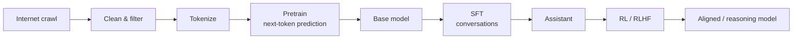

```text
INTERNET ──filter──► TOKENS ──pretrain──► BASE MODEL
                                              │
                         conversations + SFT  │
                                              ▼
                                         ASSISTANT
                                              │
                              RL (math/code) / RLHF (style)
                                              ▼
                                      PRODUCT / REASONING MODEL
```

---

## 2. Pretraining data (internet)

### Context

Before any neural network training, you need a massive text corpus. The usual starting point is a web crawl (e.g. Common Crawl), then heavy cleaning into datasets like **FineWeb** (on the order of ~1B+ pages after filtering).

Raw crawl data is noisy: duplicate pages, boilerplate HTML, wrong languages, spam, and personal information. Filtering quality strongly affects how efficiently the model learns.

### Typical filtering steps

- URL filtering (drop unwanted domains / categories)
- Text extraction (strip HTML markup)
- Language filtering (keep the target language(s))
- Deduplication (near-duplicate removal)
- PII / privacy scrubbing
- Quality heuristics (remove junk / low-signal pages)

### Diagram: data pipeline

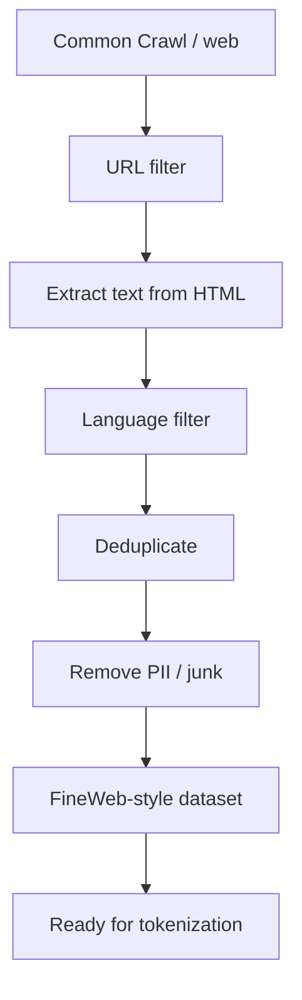

**Takeaway:** Pretraining is not “dump the internet into a model.” It is crawl → filter → tokenize → train.

---

## 3. Tokenization

### Context

Models do not read raw characters or whole words as humans do. Text is converted into **tokens** — integer IDs from a fixed vocabulary. Training and inference both operate on these IDs.

### Byte Pair Encoding (BPE)

A common algorithm:

1. Start from bytes/characters as symbols
2. Repeatedly merge the most frequent adjacent pairs into new symbols
3. Stop at a chosen vocabulary size

### Tradeoffs

| Extreme | Vocab size | Sequence length | Issue |
| --- | --- | --- | --- |
| Binary / tiny vocab | Very small | Very long | Hard for the model; expensive context |
| Character-level | Small–medium | Long | Spelling visible, but sequences long |
| Word-ish BPE (typical) | ~30k–100k | Moderate | Practical sweet spot |
| Huge vocab | Very large | Short | Embedding tables get huge |

GPT-4-class tokenizers are around ~100k tokens. Tools like **tiktokenizer** help you see how a string is split.

### Diagram: text → token IDs

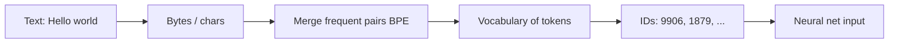

```text
"strawberry"  →  often NOT one token
                 e.g. straw | berry
                 (model doesn't "see" letters the way you do)

Binary extreme: 2 symbols, huge sequences
Character:      many tokens, long context
Word-ish BPE:   ~30k–100k vocab  ← typical LLM sweet spot
```

**Takeaway:** Tokenization is a compression + modeling choice. Weird tokenizer splits explain many “dumb” spelling/counting failures later.

---

## 4. Neural network I/O

### Context

Once text is tokens, the core supervised objective is simple:

> Given the previous tokens, predict the **next** token.

### How a training step works

1. Take a window of tokens (the **context window**)
2. Model outputs a probability distribution over the full vocabulary
3. Compare to the actual next token
4. Backpropagate and update weights so that correct tokens become more likely

Longer context helps “remember” more of the prompt/history, but compute cost grows (attention is expensive).

### Diagram: I/O contract

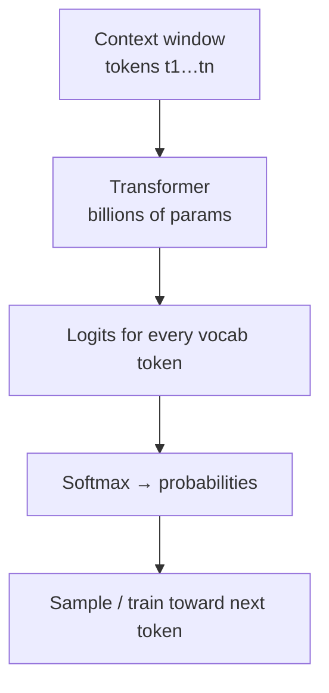

```text
Input:  [The, cat, sat, on, the]
Output: P(next) = { mat: 0.40, floor: 0.20, sofa: 0.05, ... }
```

**Takeaway:** Everything “smart” about LLMs is built on repeated next-token prediction at scale.

---

## 5. Neural network internals

### Context

The dominant architecture is the **Transformer**. Intuition (not full math):

- Tokens become vectors (**embeddings**)
- Layers of **attention** let tokens look at other tokens in the context
- Residual connections form a stream of information refined layer by layer
- Final layer produces logits → probabilities over the vocab

Billions of parameters start random and are shaped by training until the predicted distribution matches the dataset’s statistics.

Interactive visualizations (e.g. LLM architecture explainer sites Karpathy mentions) help build intuition for how tokens flow through layers.

### Diagram: high-level internals

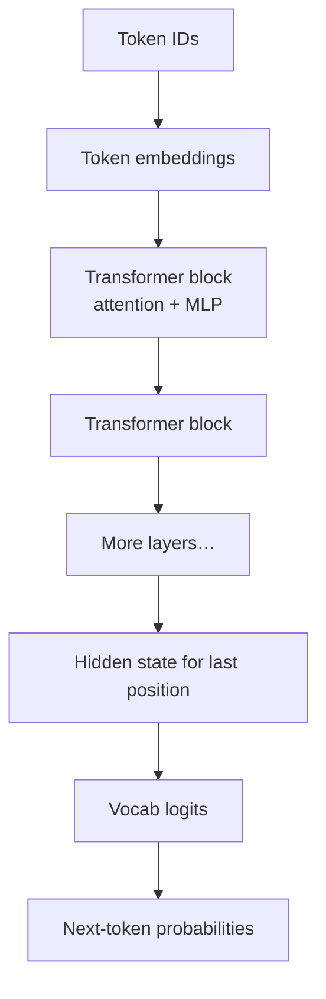

**Takeaway:** You can treat the net as a giant differentiable function: tokens in → next-token stats out.

---

## 6. Inference

### Context

**Inference** is using a trained model to generate text. Unlike training (which has a known correct next token), generation samples from the predicted distribution.

### Stochastic generation

- The model outputs probabilities, not a single deterministic string
- Sampling is like flipping a **weighted coin** over the vocab
- Temperature / top-p style controls change how “peaky” or random sampling is
- Sometimes outputs match training data closely; usually they are novel recombinations of patterns

This randomness enables creativity and also contributes to inconsistency / hallucination.

### Diagram: generation loop

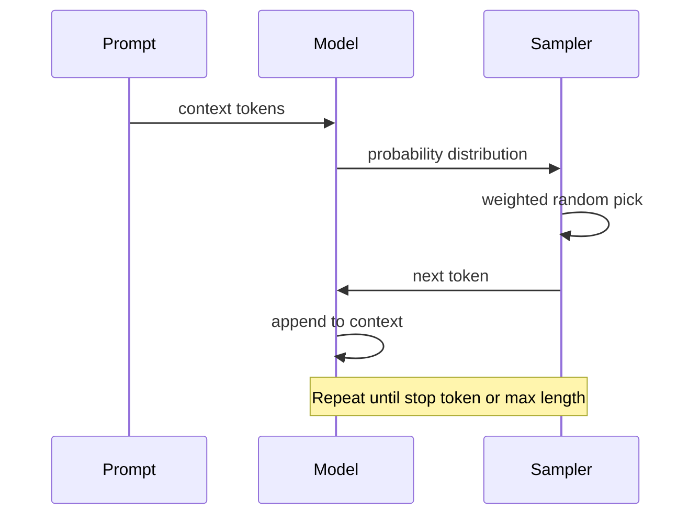

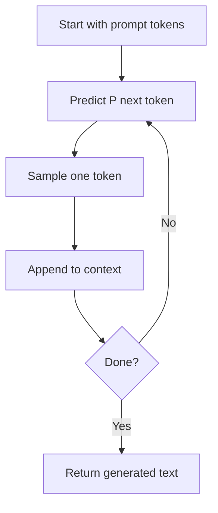

**Takeaway:** Chat is a loop of “predict → sample → append,” not a single forward retrieval of a stored answer.

---

## 7. Base models (GPT-2, Llama, etc.)

### Context

After pretraining you have a **base model**: a next-token predictor over internet-like text. It is not yet a helpful assistant.

### What “open base model” usually means

Often “open” means **open weights** (downloadable parameters) plus inference code — not necessarily full training data or a fully OSI-open AI stack.

Examples discussed in the talk:

- **GPT-2** (~1.6B params, 1024 context historically; early public transformer LM)
- **Llama 3.1** (including very large open-weight variants)

To run a base model you need:

1. **Inference code** — how to load weights and generate
2. **Weights** — the trained parameters (the valuable artifact)

### Behavior of base models

- Continue text in an “internet document” style
- Stochastic: different runs differ
- Can regurgitate fragments of training data
- Weights act like a **lossy zip file** of internet knowledge
- Can already do crude tasks via prompting (few-shot translation, pattern completion)

You can fake a weak assistant by prompting a base model with example dialogues, but that is brittle compared with real post-training.

### Cost intuition

Historical GPT-2 training was expensive. Modern data + hardware + software make similar-scale reproductions far cheaper (Karpathy’s gpt-2 / llm.c reproduction story). Efficiency gains come from cleaner data and better systems, not only bigger GPUs.

### Diagram: base model vs assistant

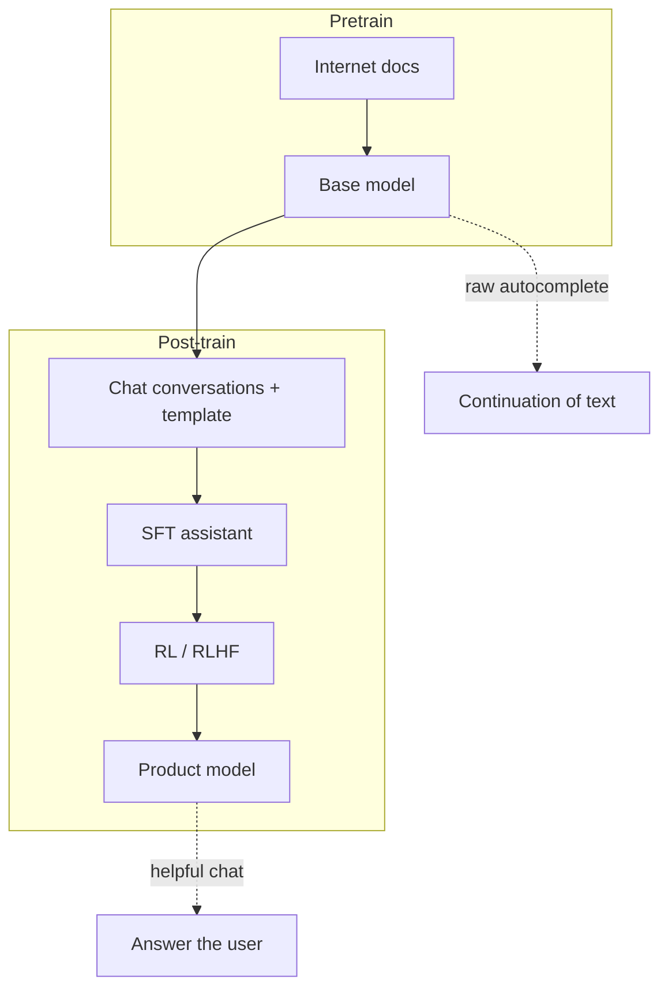

| | Base model | Assistant |
| --- | --- | --- |
| Trained on | Web documents | Dialogues (+ later RL) |
| Default behavior | Continues text | Answers users |
| Relative cost | Huge (weeks/months) | Much smaller than pretrain |
| Ready for chat product? | No | Mostly yes after SFT/RL |

**Takeaway:** Base model = world knowledge + language statistics. Assistant = that plus conversational behavior and preferences.

---

## 8. From pretraining to post-training

### Context

Pretraining teaches “what text looks like.” Post-training teaches “how to respond as a helpful assistant.”

Important practical point: **post-training is far cheaper** than pretraining. You keep the same architecture and mostly the same knowledge; you reshape how the model uses it.

### Why post-training is needed

- Base models hallucinate and ramble in document style
- They don’t reliably follow instructions
- They don’t know turn-taking, refusals, tool use, or product identity by default

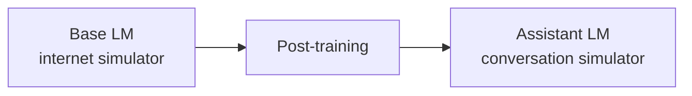

---

## 9. Post-training data (conversations)

### Context

Replace internet documents with **conversations**: system / user / assistant turns. Early datasets were heavily human-curated; later data is often partly **synthetic** (models helping generate dialogues), e.g. UltraChat-style corpora. InstructGPT is the classic paper framing for instruction-following fine-tuning.

### Chat templates

Conversations are serialized with special tokens so the model knows who is speaking. Example ChatML-style pattern:

```text
<|im_start|>system<|im_sep|>You are a helpful assistant.<|im_end|>
<|im_start|>user<|im_sep|>What is 4 + 4?<|im_end|>
<|im_start|>assistant<|im_sep|>4 + 4 = 8<|im_end|>
```

Notes:

- `<|im_start|>` / `<|im_end|>` (or similar) are structural tokens
- Many of these tokens are introduced or heavily used in post-training
- The **chat template** must match what the model was fine-tuned with (critical for local fine-tunes / Axolotl / vLLM serving)

### Diagram: conversation structure

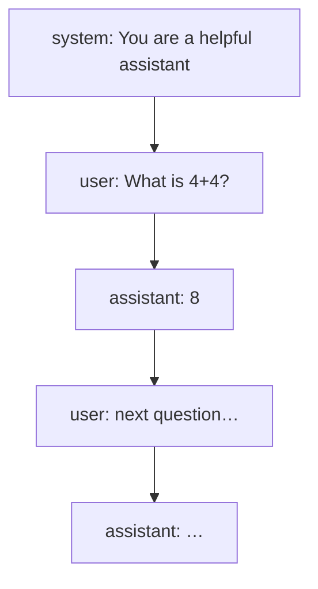

**Takeaway:** SFT teaches format + style + instruction following by imitation of ideal dialogues.

---

## 10. Hallucinations, tools, and memory

### Context

Hallucinations happen because models are trained to keep producing plausible tokens. In SFT, assistants often learn they should always answer — even when they should say “I don’t know.”

### Mitigations discussed

1. **Teach refusals / uncertainty**
   - Meta-style factuality pipelines: generate Q/A from known docs, score answers, train the model to answer when grounded and refuse when not
2. **Tool use**
   - Train the model to emit search/tool calls when knowledge is missing, then continue after results land in context
3. **Put facts in context (RAG)**
   - Working memory beats vague parametric memory for precise facts

### Example tool pattern

```text
User: Who is Orson Kovacs?
Assistant: <SEARCH_START>Who is Orson Kovacs?<SEARCH_END>
[search results injected into context]
Assistant: Orson Kovacs is ...
```

### Two kinds of memory

| Store | Analogy | Strength | Weakness |
| --- | --- | --- | --- |
| Model parameters | Long-term recollection | Broad knowledge | Fuzzy, outdated, inventable |
| Context window | Working memory | Exact, fresh, citable | Limited length / cost |

### Diagrams

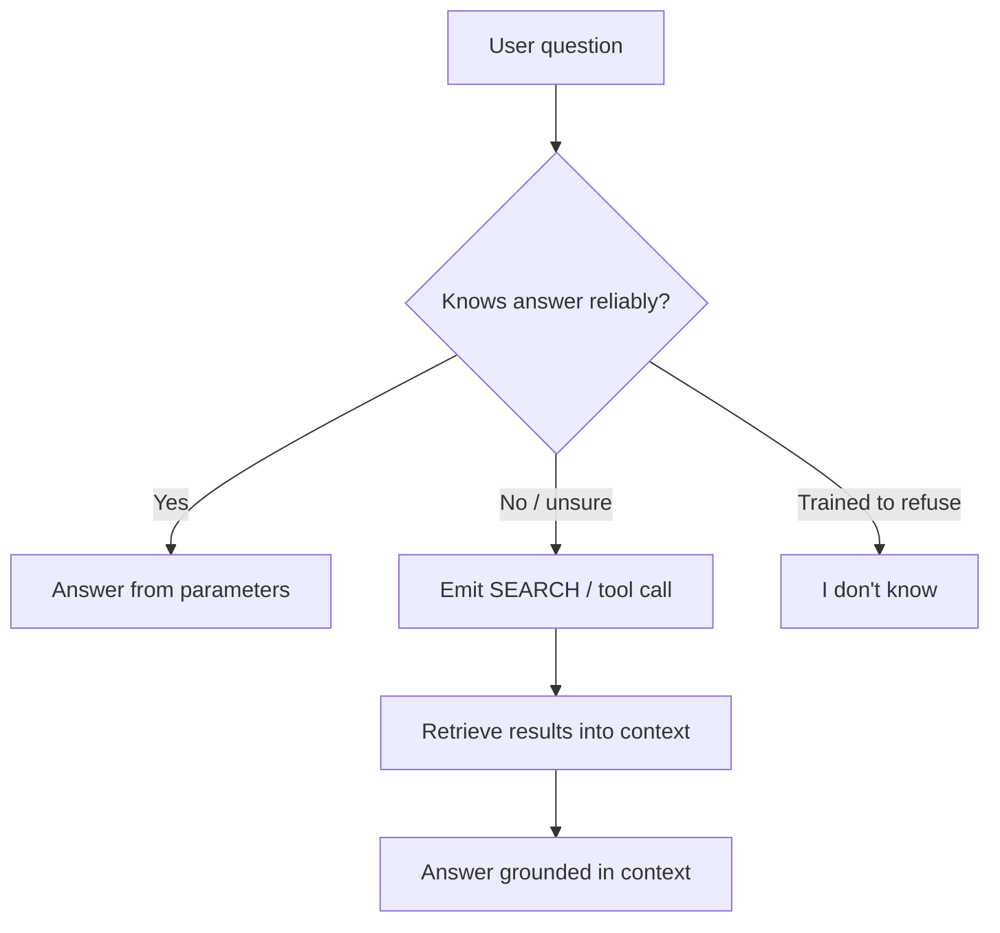

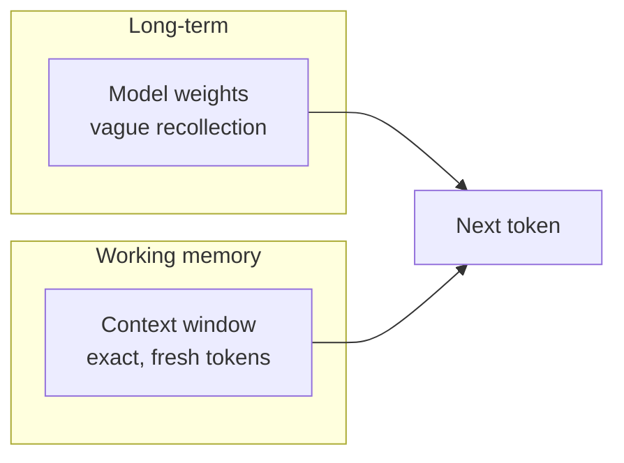

```text
Weights  ≈ "I kind of remember this from training"
Context  ≈ "here's the doc / tool result right now"
```

**Takeaway:** Fight hallucinations with refusals + tools + RAG, not by hoping the weights memorize everything perfectly.

---

## 11. Knowledge of self

### Context

A base/untuned model has **no reliable self-model**. Ask “who are you?” and it may claim to be ChatGPT / OpenAI’s model simply because that pattern dominates the internet.

### Fixes

- Include identity Q&A in post-training data (e.g. OLMo-style self-knowledge data)
- Always prepend a **system message** stating name, creator, limits, and policies

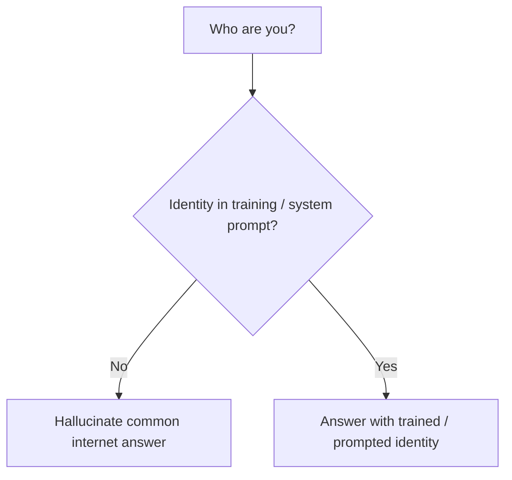

**Takeaway:** Self-knowledge is planted by data and prompts — it is not innate.

---

## 12. Models need tokens to think

### Context

Transformers do a bounded amount of computation **per generated token**. If you force an immediate final answer, the model may guess. If you allow intermediate tokens (chain-of-thought), it can stage the work across many steps.

### Bad vs good pattern

**Bad (jump to answer):**

```text
Human: Emily buys 3 apples and 2 oranges. Each orange costs $2.
The total cost of all fruit is $13. What is the cost of each apple?
Assistant: The answer is $3.
```

**Good (use tokens to compute):**

```text
Assistant: Oranges cost 2×$2 = $4.
Apples total = 13 − 4 = $9.
Each apple = 9 / 3 = $3.
```

Even better for many math/logic tasks: call a calculator/code tool instead of relying on mental arithmetic in tokens.

### Diagram

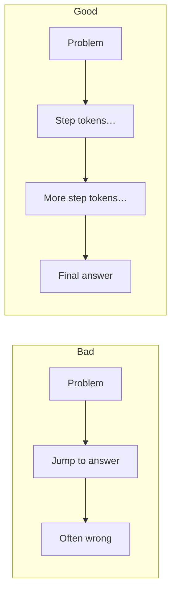

```text
Finite compute per token
  → stretch reasoning across many tokens
  → chain-of-thought / "thinking" tokens
```

**Takeaway:** “Show your work” is not just for humans — it gives the model a scratchpad.

---

## 13. Tokenization pitfalls revisited

### Context

Because models see **tokens**, not characters, they can struggle with:

- Spelling / letter counting (“how many r’s in strawberry?”)
- Certain number comparisons / formatting quirks
- Character-level manipulations that look trivial to people

These are often tokenizer + representation issues as much as “intelligence” issues.

```text
Human sees:  strawberry
Model may see: straw | berry   (or similar splits)

Counting letters inside a multi-character token is awkward.
```

**Takeaway:** When a task is character-level, prefer tools/code, or prompts that force explicit character-by-character work.

---

## 14. Supervised fine-tuning → reinforcement learning

### Context

SFT teaches by **imitation**: here’s a good answer, copy this distribution. That is powerful but limited — the model mostly learns to mimic demonstrators, not to discover better strategies.

RL adds **practice**: generate many attempts, score them, reinforce winners.

### Diagram: training progression

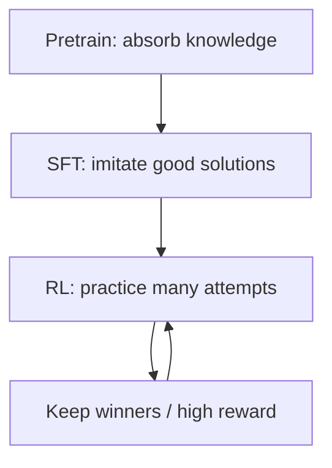

```text
SFT:  "Here's the right solution — copy this."
RL:   "Try many solutions → keep correct/high-reward ones → train → repeat."
```

| Stage | What it teaches | Human role |
| --- | --- | --- |
| Pretrain | Language + world stats | Build/filter dataset |
| SFT | How to answer like an assistant | Write / curate dialogues |
| RL (verifiable) | Search for better strategies | Define graders / checkers |
| RLHF | Prefer answers humans like | Rank responses; train reward model |

---

## 15. Reinforcement learning & DeepSeek-R1

### Context

In **verifiable** domains (math, coding with tests, games), you can often grade answers automatically. Then humans can leave the inner loop:

1. Sample many solutions for one problem
2. Keep the ones that pass the checker (and maybe prefer shorter / cleaner)
3. Train on winners
4. Repeat

Karpathy highlights **DeepSeek-R1** as a public window into this style of reasoning RL: as training progresses, models often use **more thinking tokens** and develop behaviors (including “aha” style re-evaluation) that were not directly handwritten as SFT demonstrations.

### AlphaGo analogy

- Imitation learning alone has a ceiling near human demonstrators
- RL can discover strategies beyond the dataset
- Famous example: AlphaGo **Move 37** — surprising to humans, low prior under human play, strong in hindsight

Implication for LLMs: with the right rewards, models may invent reasoning patterns (even token conventions) that humans didn’t explicitly teach — including potentially alien internal “scratch languages” if those help score.

### Diagram: RL practice loop

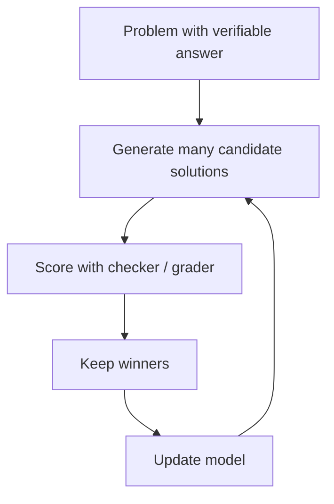

```text
Example:
  Generate 15 solutions
  4 are correct
  Prefer correct + concise
  Train on those
  Repeat many times
```

**Takeaway:** RL turns the model from “student copying notes” into “student doing practice problems.”

---

## 16. RLHF

### Context

Many tasks are **not** automatically verifiable: “write a joke about pelicans,” “summarize more helpfully,” “be polite.” You cannot easily write a unit test for joke quality.

**RLHF (Reinforcement Learning from Human Feedback)** addresses this:

1. Model generates candidate answers
2. Humans **rank** them (easier than writing the perfect answer)
3. Train a **reward model** to predict those rankings
4. Optimize the LLM against the reward model

This exploits the **discriminator–generator gap**: people are better at judging than producing.

### Upsides

- Enables preference learning in subjective domains
- Can reduce some bad behaviors and improve helpfulness / style
- Scales better than having humans write every ideal answer

### Downsides / failure modes

- Reward model is only a **lossy simulator** of human judgment
- Policy can **game** the reward model (reward hacking / adversarial examples)
- Too much optimization → collapse into nonsense that still scores high on the RM
- In practice, RLHF is often run carefully / not for unlimited steps

### Diagram: RLHF flow

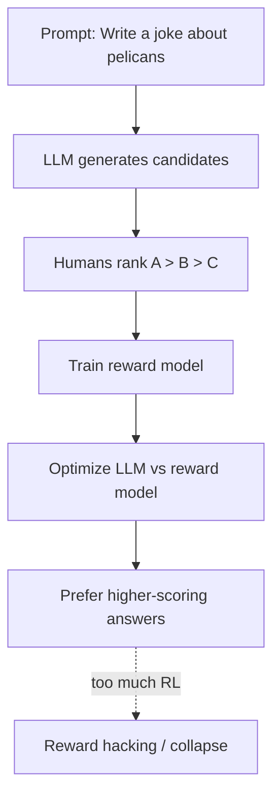

```text
Easy to judge  ≠  easy to write
Cap RL against imperfect reward models
  or the policy will find loopholes
```

**Takeaway:** RLHF is powerful preference glue for products — and fragile if over-optimized.

---

## 17. Preview of what’s next

Karpathy’s forward-looking themes:

- **Multimodal** models (text + image + audio + video)
- **Agents** with longer horizons, memory, and self-correction
- **Pervasive AI** embedded into everyday software
- **Computer-using** models that operate UIs / tools
- Better learning at **test time** (adapt during use, not only during training)

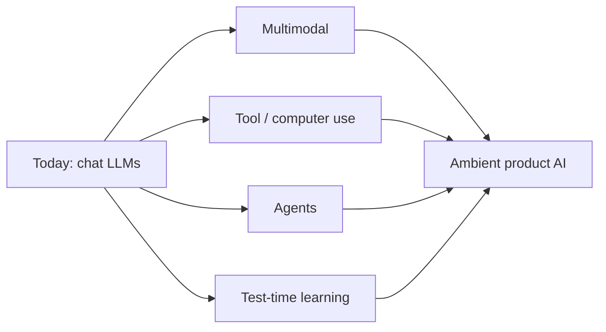

---

## 18. One-page cheat sheet

### End-to-end mental model

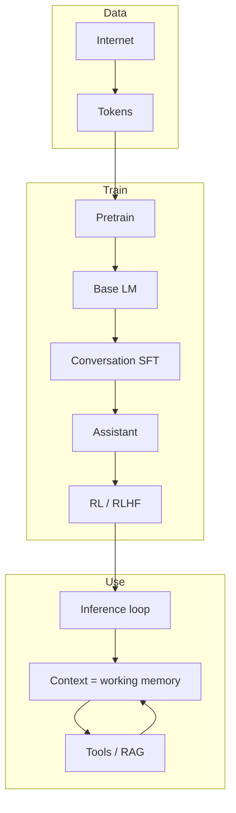

### Runtime loop

```text
prompt → [context…] → sample next token → append → … → answer
         + tools/search when parametric memory is not enough
```

### Core intuitions

1. **Pretrain** compresses the internet into a next-token predictor
2. **SFT** makes it chat like an assistant by imitation
3. **RL/RLHF** teaches practice and preferences
4. **Weights** = fuzzy long-term memory; **context** = working memory
5. **Tokens to think** and **tools** fix many “reasoning” and factuality failures
6. LLMs are powerful **simulators** of text/processes — not guaranteed truth engines

### Grand summary line

> ChatGPT-like systems are lossy neural simulations of internet text, then of demonstrator assistants, then of preference/practice signals — generating useful behavior token by token.

---

## Source

- Video: [Deep Dive into LLMs like ChatGPT — Andrej Karpathy](https://www.youtube.com/watch?v=7xTGNNLPyMI)
- These notes are a structured study guide with Mermaid diagrams for revision; watch the original for full explanations, demos, and nuance.
